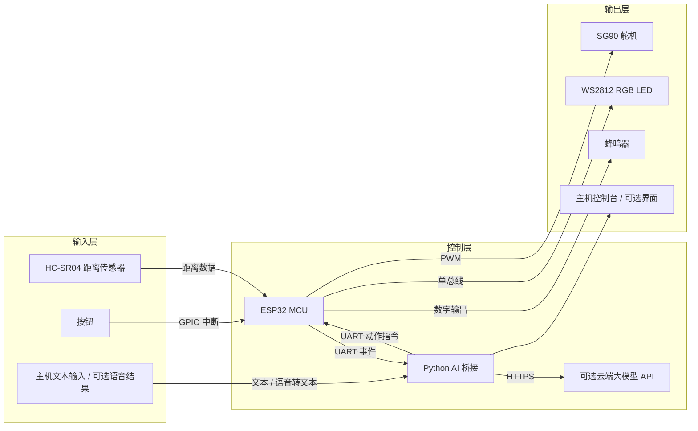
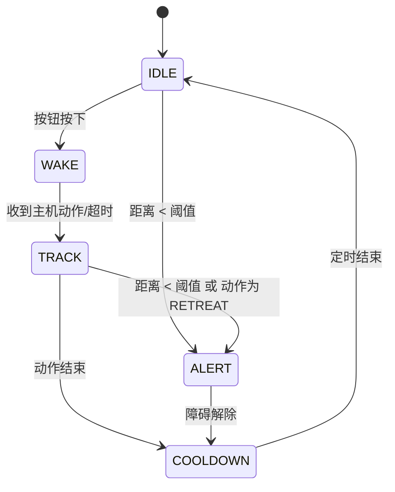

# 系统架构设计

## 总体结构图

## 各模块作用

### 输入模块

- 按钮：人为触发一次交互，最稳定，适合演示。
- 距离传感器：检测前方障碍物，用于“靠太近就警觉/后退”的闭环行为。
- 主机输入：可选的文本输入或语音转文本结果，用来触发更像 AI 的上层逻辑。

### 控制模块

- ESP32：负责所有实时任务，包括采样、状态机、执行器控制和串口通信。
- Python AI 桥接：负责把“事件”转换成“动作建议”。
- 云端 API：只做高层语义判断，不直接控制硬件。

### 输出模块

- 舵机：表现头部转动或后仰动作。
- LED：用颜色表达状态。
- 蜂鸣器：提供确认音和告警音。
- 主机界面：打印日志，辅助演示和调试。

## 数据流

标准数据流是：

`input -> MCU状态判断 -> 可选AI决策 -> 执行动作 -> 传感器再次反馈`

具体表现为：

1. 用户按按钮，ESP32 进入 `WAKE`。
2. ESP32 把 `EVENT:BUTTON` 发送给 Python。
3. Python 根据本地规则或云端返回 `ACT:GREET / ACT:THINK / ACT:RETREAT`。
4. ESP32 根据动作驱动舵机、LED、蜂鸣器。
5. 若距离传感器检测到前方过近，ESP32 直接切到 `ALERT`，不等待云端。

## 状态机设计

## 主循环与中断机制

这个设计同时使用了“中断 + 主循环”：

- 按钮通过 GPIO 中断触发，只负责置位事件标志。
- 主循环负责：
  - 周期性读取距离传感器
  - 处理串口消息
  - 执行状态迁移
  - 控制舵机、LED、蜂鸣器

这样做的原因是：

- 中断逻辑保持极简，避免在 ISR 中做耗时动作。
- 所有复杂行为统一在主循环状态机里处理，更容易调试和解释。

## AI 接入选择

### 默认选择：本地规则 + 可选云端扩展

原因：

- 按钮、避障这类行为对实时性要求更高，不适合完全依赖网络。
- 作业时间有限，本地规则更稳，云端作为扩展更容易保底。
- 分层之后，答辩时可以明确说明：安全相关和基础闭环在本地，高层语义放在云端。

## 延迟与成本权衡

- 本地规则：延迟最低、成本几乎为零、稳定性最好，但智能程度有限。
- 云端 API：表达能力更好，但存在网络延迟、API 成本和失败重试问题。

因此本项目采用：

- `实时控制 = MCU 本地`
- `高层策略 = 主机本地规则或云端 AI`

