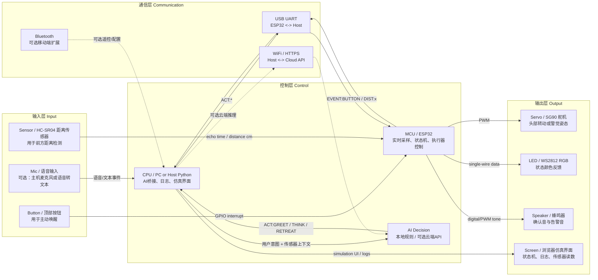
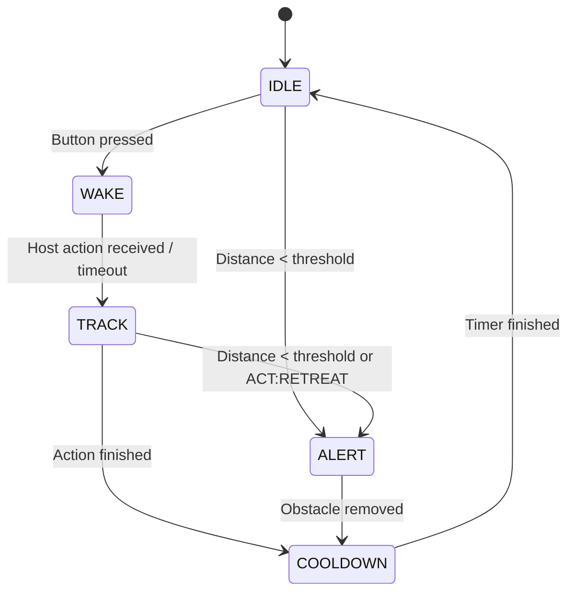

# 系统架构设计

## 完整系统结构图

## 模块作用

### 输入模块

- `Mic / 语音输入`：可选输入，用于把用户语音转成文本意图。当前 MVP 中不依赖实体麦克风，浏览器仿真和主机侧输入可以替代语音入口。
- `Button / 顶部按钮`：主要交互入口。用户按下按钮后，ESP32 触发中断并进入唤醒流程。
- `Sensor / HC-SR04 距离传感器`：检测前方距离，用于实现“靠太近就警觉/避让”的实时闭环。

### 控制模块

- `MCU / ESP32`：负责实时控制，包括读取按钮和距离传感器、运行状态机、控制舵机/LED/蜂鸣器，并通过 UART 与主机通信。
- `CPU / Host Python`：负责高层逻辑，包括接收 MCU 事件、执行本地 AI 规则、调用可选云端 API、记录日志，以及运行浏览器仿真界面。
- `AI Decision`：把输入事件和上下文转换成动作建议，例如 `GREET`、`THINK`、`RETREAT`。实时安全动作仍由 MCU 本地兜底。

### 输出模块

- `Servo / SG90 舵机`：表现头部动作，例如问候时左右摆动、告警时抬头或转向。
- `LED / WS2812 RGB`：用颜色表达状态，例如待机蓝、唤醒绿、告警红、冷却橙。
- `Speaker / 蜂鸣器`：输出确认音和告警音，让反馈更明确。
- `Screen / 浏览器仿真界面`：展示状态机、距离数值、AI 决策、串口日志和输出状态；没有实体硬件时作为主要演示界面。

### 通信模块

- `USB UART`：MVP 的核心通信方式，连接 ESP32 和主机。ESP32 上报事件，主机返回动作指令。
- `WiFi / HTTPS`：可选云端 AI 链路。主机通过网络调用 API，但不让云端直接控制底层硬件。
- `Bluetooth`：可选扩展链路，可用于手机端遥控、参数配置或演示模式切换。

## 数据如何流动

系统的数据流可以概括为：

`input -> MCU/CPU decision -> action command -> output -> feedback`

具体过程如下：

1. `Button` 被按下，ESP32 通过 GPIO 中断记录事件，状态从 `IDLE` 进入 `WAKE`。
2. `HC-SR04` 周期性输出距离数据，ESP32 将 echo 时间转换为距离，并进行阈值判断。
3. ESP32 通过 `USB UART` 发送事件，例如 `EVENT:BUTTON` 或 `DIST:12.5`。
4. 主机侧 Python 接收事件，把按钮、距离、当前状态交给本地规则或可选云端 AI。
5. AI 决策层输出动作，例如 `ACT:GREET`、`ACT:THINK`、`ACT:RETREAT`。
6. 主机通过 `USB UART` 把动作指令发回 ESP32。
7. ESP32 根据动作和本地状态机控制输出：
   - 舵机执行头部动作
   - LED 切换状态颜色
   - 蜂鸣器播放确认音或告警音
   - 浏览器界面显示状态、日志和仿真效果
8. 如果距离低于安全阈值，ESP32 直接进入 `ALERT`，不等待云端结果，保证实时性。

## 设计要点

- 底层实时控制放在 ESP32，避免网络延迟影响安全反馈。
- 高层 AI 决策放在主机或云端，便于扩展语音、对话和复杂策略。
- 当前无实体硬件时，浏览器仿真器复现同一套输入、状态机、通信日志和输出反馈。

## 状态机设计

## 主循环与中断机制

这个设计同时使用“中断 + 主循环”：

- 按钮通过 GPIO 中断触发，只负责置位事件标志。
- 主循环负责周期性读取距离传感器、处理串口消息、执行状态迁移，并控制舵机、LED、蜂鸣器。

这样做可以让中断逻辑保持简单，也让所有复杂行为集中在状态机中，便于调试和展示。

## AI 接入选择

默认采用“本地规则 + 可选云端 API”的双模方案：

- 本地规则：低延迟、低成本、稳定，适合按钮反馈和避障类实时行为。
- 云端 API：表达能力更强，适合扩展语音理解和对话策略，但存在网络延迟和成本。

因此本项目采用：

- `实时控制 = MCU 本地`
- `高层策略 = 主机本地规则或云端 AI`
